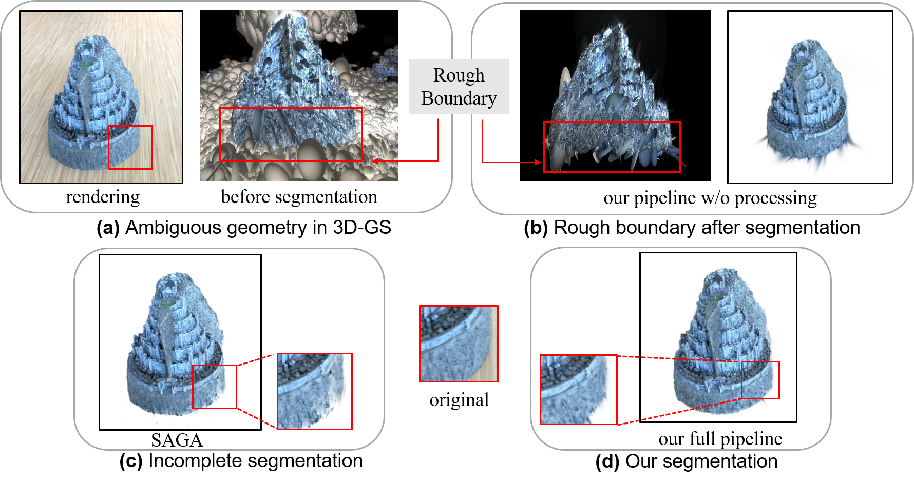
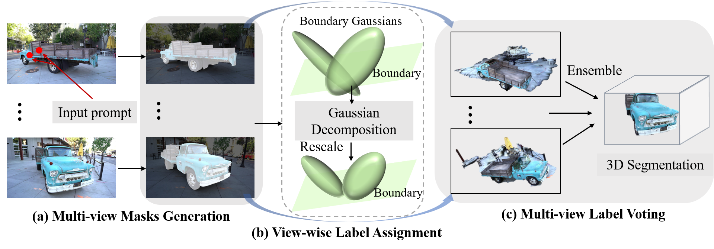

# SAGS (Segment Anything in 3D Gaussians)

## Introduction
3D Gaussian Splatting has emerged as an alternative 3D representation for novel view synthesis, benefiting from its high-quality rendering results and real-time rendering speed. However, the 3D Gaussians learned by 3D-GS have ambiguous structures without any geometry constraints. This inherent issue in 3D-GS leads to a rough boundary when segmenting individual objects. To remedy these problems, we propose SAGD, a conceptually simple yet effective boundary-enhanced segmentation pipeline for 3D-GS to improve segmentation accuracy while preserving segmentation speed. Specifically, we introduce a Gaussian Decomposition scheme, which ingeniously utilizes the special structure of 3D Gaussian, finds out, and then decomposes the boundary Gaussians. Moreover, to achieve fast interactive 3D segmentation, we introduce a novel training-free pipeline by lifting a 2D foundation model to 3D-GS. Extensive experiments demonstrate that our approach achieves high-quality 3D segmentation without rough boundary issues, which can be easily applied to other scene editing tasks.

## Overall Pipeline

(a) Given a set of clicked points on the 1st rendered view, we utilize SAM to generate masks for corresponding objects under every view automatically; (b) For every view, Gaussian Decomposition is performed to address the issue of boundary roughness and then label propagation is implemented to assign binary labels to each 3D Gaussian; (c) Finally, with assigned 3D labels from all views, we adopt a simple yet effective voting strategy to determine the segmented Gaussians.

## Segmentation Results

## Boundary-Enhanced Segmentation

## More Applications
